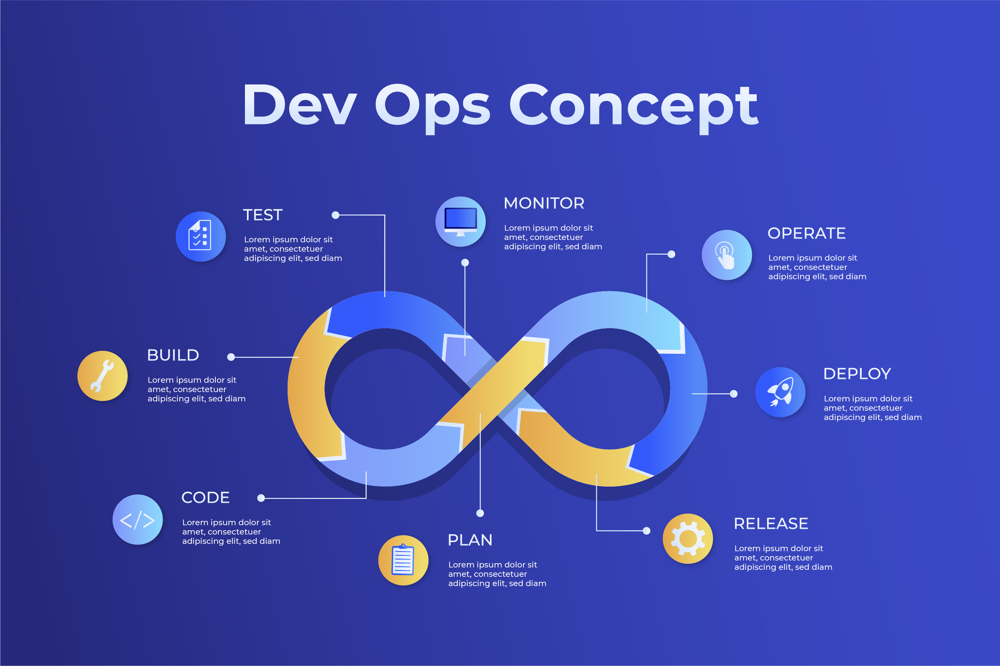

# 🚀 DevOps Final Project – *Strive for Progress, Not Perfection*  

Welcome to the **DevOps Mentor–Mentee Project** 🤝.  
This repository is designed to guide you step by step through building a **complete DevOps pipeline** — from coding an application, to deploying it with modern DevOps practices.  

---

## 📌 Project Prerequisites  

Before starting, please install the following tools (latest versions recommended):  

- [🐍 Python](https://www.python.org/downloads/) (or another language of your choice)  
- [🍃 MongoDB](https://www.mongodb.com/try/download/community)  
- [🐳 Docker](https://www.docker.com/get-started/)  
- [☸️ Kubernetes](https://kubernetes.io/docs/tasks/tools/)  
- [⚡ Git](https://git-scm.com/downloads)  
- [🔄 GitHub Actions](https://docs.github.com/en/actions)  
- [🚀 ArgoCD](https://argo-cd.readthedocs.io/en/stable/getting_started/)  
- [📦 Terraform](https://developer.hashicorp.com/terraform/downloads)  
- [📊 Grafana](https://grafana.com/get)  
- [📈 Prometheus](https://prometheus.io/download/)  

---

## 📖 Table of Contents  

Each step has its own folder 📂 with a detailed `README.md`.  
Click the **logos/emojis** below to jump directly to that step’s guide:  

| Step | Topic | Link |
|------|-------|------|
| 01 | 🖥️ **Introduction & Git Basics** | [📂 Step_01-Starting_With_GitHub](./Step_01-Starting_With_GitHub/README.md) |
| 02 | 📝 **Application Development** | [📂 Step_02-AppDevelopment](./Step_02-AppDevelopment/README.md) |
| 03 | 🍃 **MongoDB Installation** | [📂 Step_03-MongoDB_Installation_And_Configuration](./Step_03-MongoDB_Installation_And_Configuration/README.md) |
| 04 | 🐳 **Docker** | [📂 Step_04-Docker_Setup_and_Implementation](./Step_04-Docker_Setup_and_Implementation/README.md) |
| 05 | ☸️ **Kubernetes** | [📂 Step_05-K8_Setup_And_Implementation](./Step_05-K8_Setup_And_Implementation/README.md) |
| 06 | 🔄 **Continuous Integration (CI)** | [📂 Step_06-Continuous_Integration(CI)](./Step_06-Continuous_Integration(CI)/README.md) |
| 07 | 🚀 **Continuous Deployment (CD)** | [📂 Step_07-Continuous_Deployment(CD)](./Step_07-Continuous_Deployment(CD)/README.md) |
| 08 | 📦 **Infrastructure as Code (IaC)** | [📂 Step_08-Infrastructure_As_Code(IaC)](./Step_08-Infrastructure_As_Code(IaC)/README.md) |
| 09 | 📊 **Monitoring & Logging** | [📂 Step_09-Monitoring_And_Logging](./Step_09-Monitoring_And_Logging/README.md) |
| 10 | 🔐 **Security Implementation** | [📂 Step_10-Security_Implementation](./Step_10-Security_Implementation/README.md) |
| 11 | 🏆 **Best Practices** | [📂 Step_11-Best_Practice](./Step_11-Best_Practice/README.md) |

---

## 🧩 Project Flow  

1. **Set up Git & version control** 🖥️  
2. **Develop an application** (Python example provided, but flexible) 📝 
3. **Add a database** (MongoDB) 🍃 
4. **Containerize with Docker** 🐳 
5. **Orchestrate with Kubernetes** ☸️  
6. **Automate testing (CI)** 🔄  
7. **Automate deployments with ArgoCD (CD)** 🚀  
8. **Manage infra with Terraform (IaC)** 📦  
9. **Add monitoring & logging (Grafana, Prometheus, ELK)** 📊  
10. **Secure the pipeline** 🔐 
11. **Follow best practices: code reviews, docs, automation** 🏆 

---

## 🖼️ Visuals 
    Devops Life-Cycle  

  

---

## 🤝 Mentor–Mentee AI Collaboration  

This project is part of a **DevOps mentorship journey**.  
Feel free to use, fork, and extend! 💡  

---

## 📚 Resources  

- [DevOps Roadmap](https://roadmap.sh/devops)  
- [Kubernetes Official Docs](https://kubernetes.io/docs/)  
- [Docker Official Docs](https://docs.docker.com/)  
- [Terraform Tutorials](https://developer.hashicorp.com/terraform/tutorials)  
- [ArgoCD Docs](https://argo-cd.readthedocs.io/)  

---
